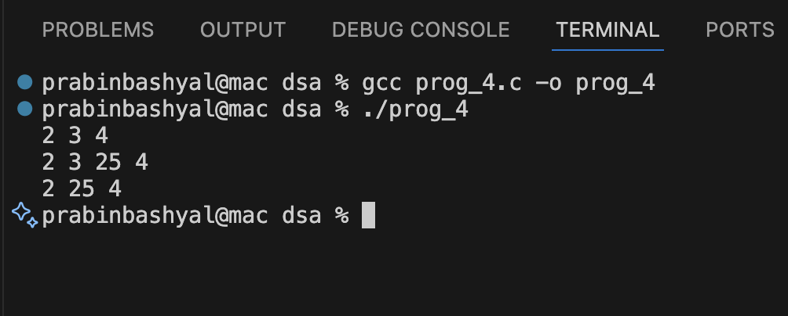

# Doubly Linked List Implementation in C

## GIVEN QUESTION:
**How can we implement the doubly linked list using structure? Write a method to
insert(after given node) and delete the node in a doubly linked list. Write main() to
demonstrate the use of the functions.**

This program implements a Doubly Linked List in C and performs insertion and deletion operations.

## Structure Used
```c
struct Node {
    int data;
    struct Node *prev;
    struct Node *next;
};
```

- `data` → Stores value
- `prev` → Points to previous node
- `next` → Points to next node

## Functions Used

### insertAfter(struct Node* p, int value)
- Creates a new node.
- Inserts the new node after the given node `p`.
- Updates both `prev` and `next` pointers properly.

### deleteNode(struct Node** head, struct Node* del)
- Deletes the given node `del`.
- Updates previous and next node links.
- Frees memory using `free()`.

### display(struct Node* head)
- Traverses the list from head.
- Prints all node values.

### ON `main()`
- Initial list:

        2  3  4

- After insertAfter(second, 25):

        2  3  25  4

- After deleteNode(&head, second):

        2  25  4

## Sample Output
