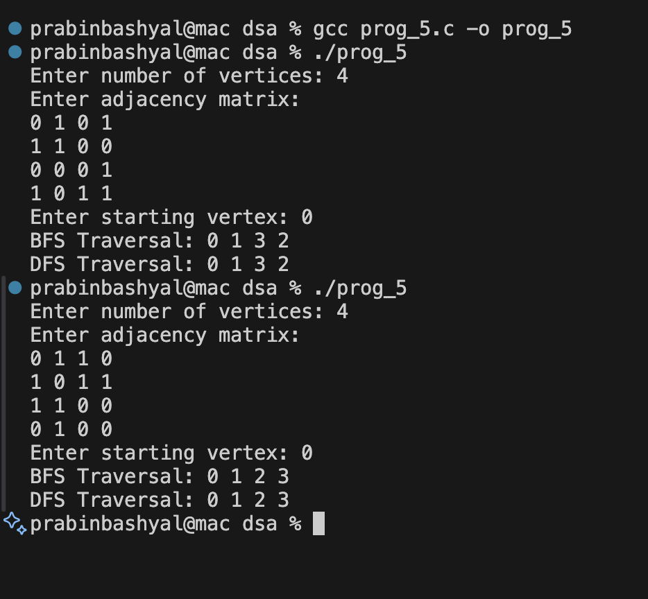

# Undirected Graph Using Adjacency Matrix with BFS and DFS in C

## GIVEN QUESTION:
**How can we implement an undirected graph using an adjacency matrix? Write functions to implement BFS and DFS traversal. Demonstrate the program with an example graph.**

This program represents an undirected graph using an adjacency matrix and performs Breadth First Search (BFS) and Depth First Search (DFS) traversals.

## Graph Representation

- `adj[MAX][MAX]` → Stores adjacency matrix
- `visited[MAX]` → Tracks visited vertices
- `n` → Number of vertices

If there is an edge between vertex `i` and `j`, then:
```
adj[i][j] = 1
adj[j][i] = 1
```

## Functions Used

### BFS(int start)
- Uses a queue.
- Marks starting vertex as visited.
- Visits all adjacent unvisited vertices level by level.
- Follows FIFO (First In First Out).

### DFS(int v)
- Uses recursion.
- Marks current vertex as visited.
- Recursively visits all adjacent unvisited vertices.
- Follows depth-wise traversal.

## Sample Output
