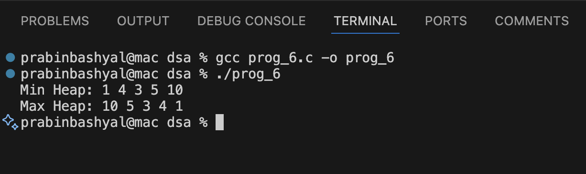

# Build Min Heap and Max Heap from Unsorted Array in C

## GIVEN QUESTION:
**6. Given the array of the data (unsorted), Write a program to build the min and max heap.**

This program converts an unsorted array into:
- Min Heap
- Max Heap

using the heapify (recursive) method.

## What is a Heap?

A Heap is a special type of Complete Binary Tree that satisfies the heap property.

## Properties of Heap

1. **It is a Complete Binary Tree**
   - All levels are completely filled except possibly the last level.
   - Last level is filled from left to right.

2. **It follows Heap Order Property:**
   - Min Heap → Parent ≤ Children
   - Max Heap → Parent ≥ Children

## Array Representation of Heap

Heap is usually stored in an array.

For index `i`:
- Left Child → `2*i + 1`
- Right Child → `2*i + 2`
- Parent → `(i - 1)/2`

No need to use pointers like linked list.

## Functions Used

### swap()
- Swaps two elements.

### minHeap()
- Compares parent with children.
- Places smallest element at root.
- Uses recursion to maintain heap property.

### buildMinHeap()
- Starts heapify from last non-leaf node.
- Builds complete Min Heap.

### maxHeap()
- Places largest element at root.

### buildMaxHeap()
- Builds complete Max Heap.

## Sample Output
