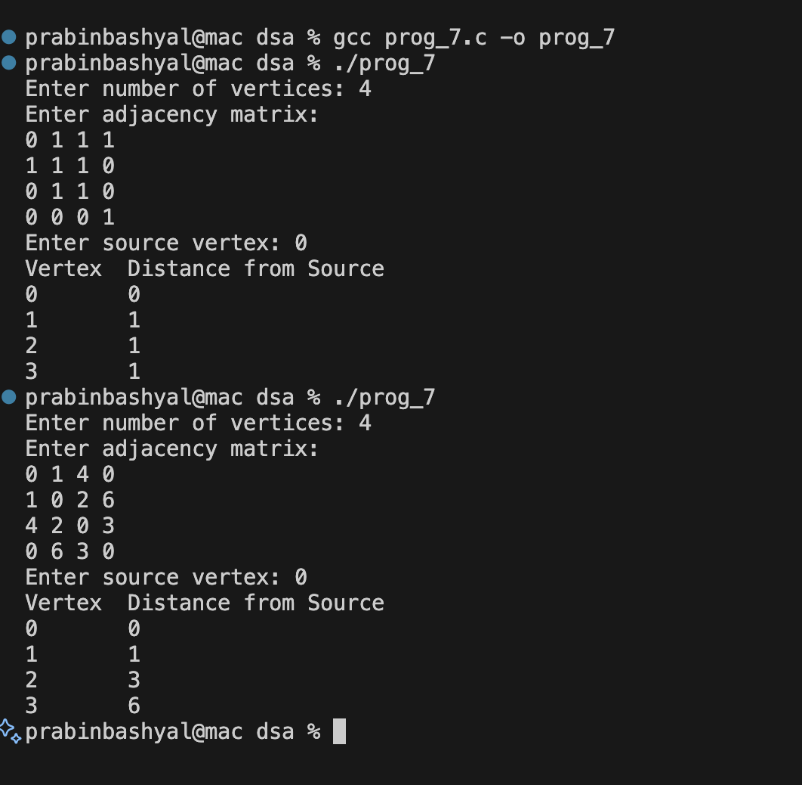

# Dijkstra's Algorithm for Shortest Path in C

## GIVEN QUESTION:
**Given a weighted graph, implement Dijkstra's algorithm to find the shortest path from a source node to all other nodes.**

This program finds the shortest distance from a given source vertex to all other vertices in a weighted graph using Dijkstra's Algorithm.

## What is Dijkstra's Algorithm?

Dijkstra's Algorithm is a greedy algorithm used to find the shortest path from a source vertex to all other vertices in a graph.

**Conditions:**
- Graph must have non-negative edge weights.
- Works for both directed and undirected weighted graphs.

## Graph Representation

- Graph is represented using an Adjacency Matrix.
- `graph[i][j]` stores weight of edge between vertex `i` and `j`.
- If there is no edge → value is `0`.

## Functions Used

### minDistance(int dist[], int visited[])
- Finds the unvisited vertex with minimum distance.
- Returns its index.

### dijkstra(int graph[MAX][MAX], int src)
1. Initialize:
   - All distances = `INF`
   - All vertices = unvisited
   - Distance of source = `0`
2. Repeat:
   - Pick vertex with minimum distance.
   - Mark it as visited.
   - Update distances of adjacent vertices.

## Sample Output
