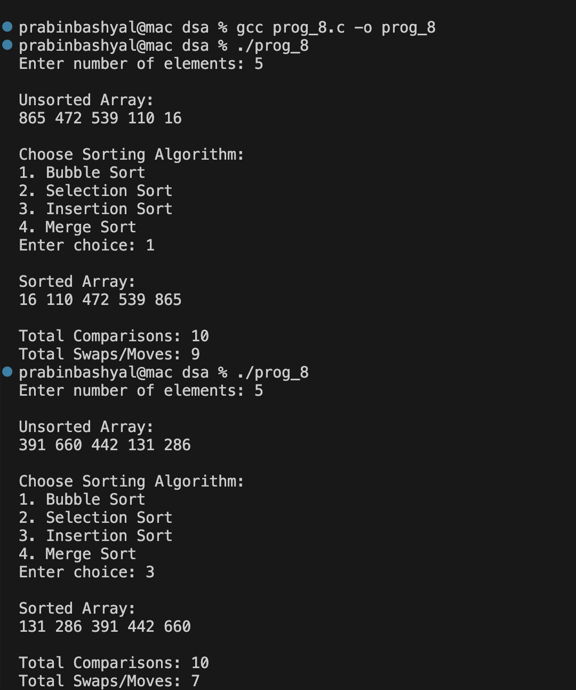

# Sorting Random Integers Using Multiple Algorithms in C

## GIVEN QUESTION:
**Write a program that generates a list of N random integers in the range [1, 1000], where N
is provided by the user at run time. Then, perform the following tasks:
(a) Ask the user to choose a sorting algorithm from the following:
• Bubble Sort
• Selection Sort
• Insertion Sort
• Merge Sort
(b) Sort the randomly generated numbers using the chosen algorithm.
(c) Print the numbers before and after sorting.
(d) Display the total number of comparisons and swaps (if applicable) performed by the
chosen algorithm.**

This program:
- Generates N random numbers
- Lets user choose a sorting method
- Prints array before and after sorting
- Displays number of comparisons and swaps/moves

## Functions Used

### swap(int *a, int *b)
- Swaps two elements using a temporary variable.
- Increments the `swaps` counter.

### bubbleSort(int a[], int n)
- Repeatedly compares adjacent elements.
- Swaps them if they are in wrong order.
- Counts total comparisons and swaps.

### selectionSort(int a[], int n)
- Finds the minimum element in each pass.
- Swaps it with the current position.
- Counts comparisons and swaps.

### insertionSort(int a[], int n)
- Inserts each element into its correct sorted position.
- Shifts elements to the right when needed.
- Counts comparisons and element moves (treated as swaps).

### merge(int a[], int l, int m, int r)
- Merges two sorted subarrays.
- Compares elements from left and right halves.
- Counts comparisons and element moves.

### mergeSort(int a[], int l, int r)
- Recursively divides the array into halves.
- Calls `merge()` to combine sorted halves.
- Implements Divide and Conquer technique.

### printArray(int a[], int n)
- Prints all elements of the array.
- Used to display unsorted and sorted arrays.

### main()
- Takes number of elements from user.
- Generates random numbers using `rand()` in range 1–1000.
- Displays menu for sorting choice.
- Calls selected sorting function.
- Prints sorted array.
- Displays total comparisons and swaps.

## Sorting Algorithms Implemented

| Algorithm | Description | Time Complexity |
|-----------|-------------|-----------------|
| Bubble Sort | Compares adjacent elements and swaps if needed | O(n²) |
| Selection Sort | Finds minimum element and swaps with current position | O(n²) |
| Insertion Sort | Inserts each element into correct position | O(n²) (Best O(n)) |
| Merge Sort | Divides array recursively and merges sorted halves (Divide & Conquer) | O(n log n) |

## Sample Output
